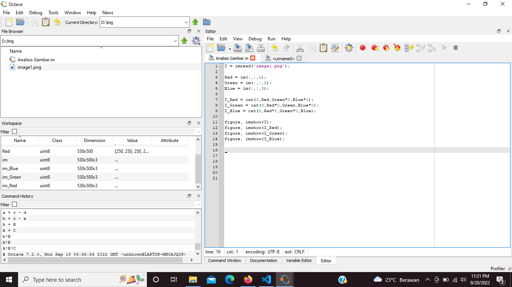
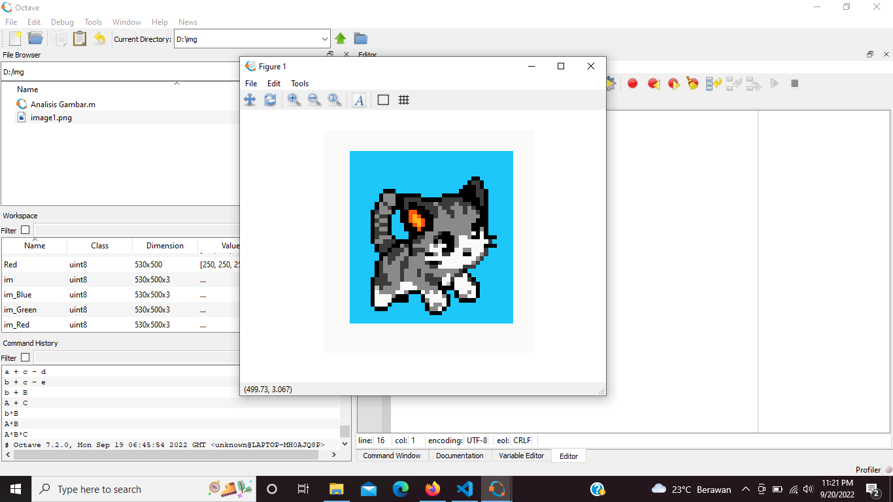
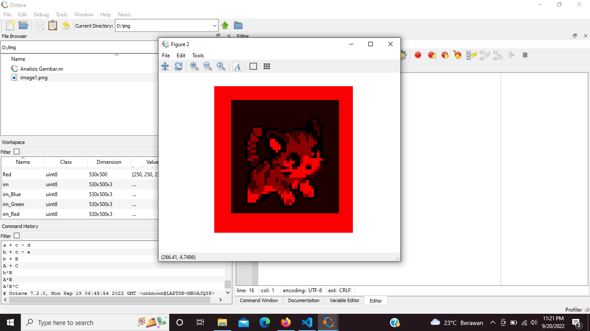
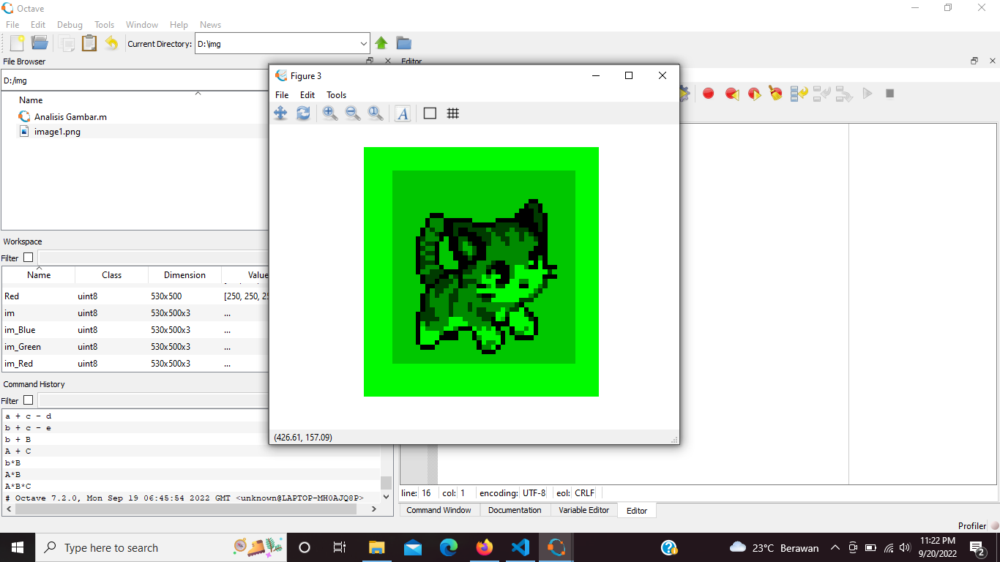
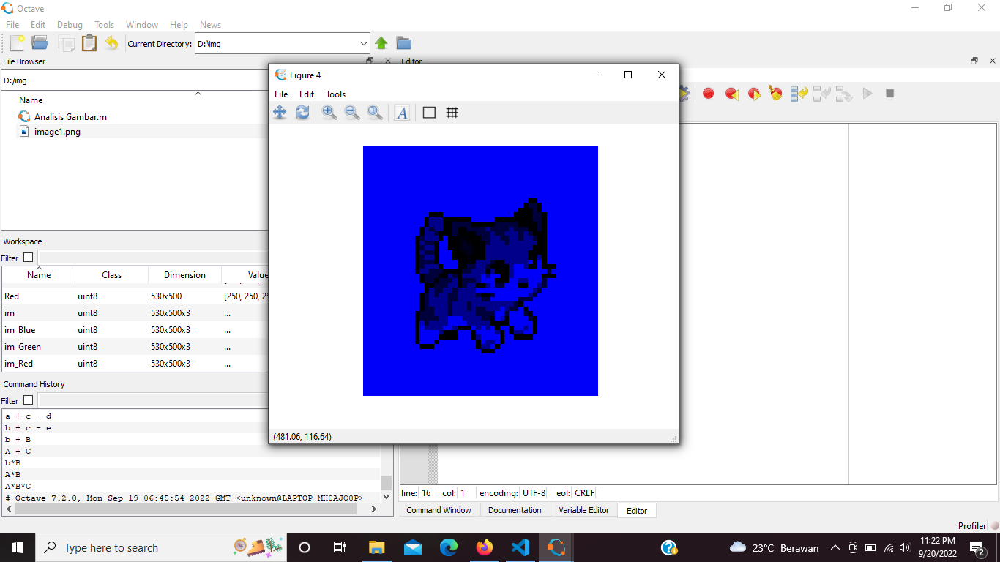
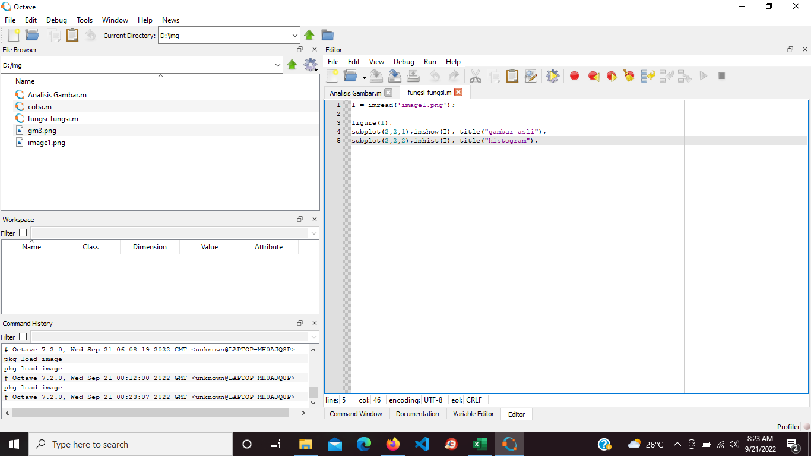
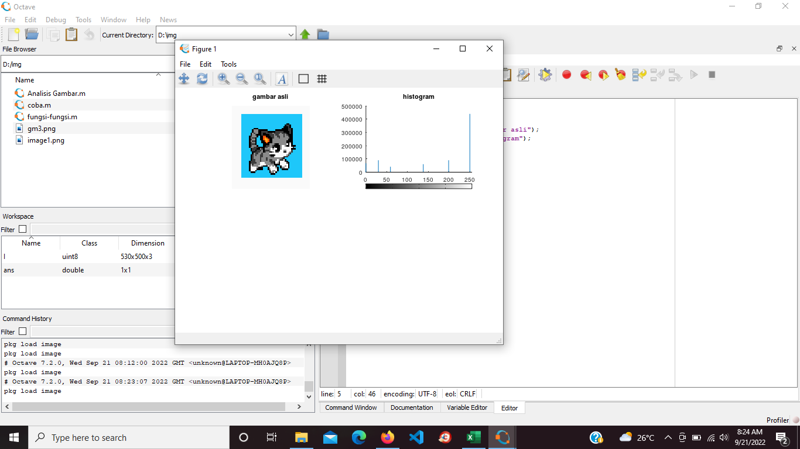

**Nama : Meyda Wikaromah**

**Nim : 2110131220015**

**Mata Kuliah : Pemrosesan Citra Digital**

### **1. Layer pada gambar berwarna.**

Gambar berwarna (representasi RGB) menggunakan  matriks  3D  dengan  3  buah layer. Layer 1  untuk 
warna merah (red), layer 2 untuk warna hijau (green), dan layer 3 untuk warna biru  (blue). 

Selain ketiga warna layer juga terdapat warna-warna lainnya. Warna-warna tersebut diperoleh dari perpaduan nilai elemen dari ketiga layer.  Elemen  pada  masing-masing  layer  memiliki  range  0-255  dan  masing-masing elemen memiliki kedalaman warna 8 bit. Karena terdapat 3 buah layer pada  citra  RGB  sehingga  total  kombinasi  warna  yang  dapat  dihasilkan  oleh 
citra RGB adalah 256 x 256 x 256 = 16.777.216 kombinasi warna.  

Berikut hasil eksplorasi layer pada aplikasi octave :

Setelah di Run :

Gambar yang dianalisis.

Layer 1 (Red).

Layer 2 (Green).

Layer 3 (Blue).

### **2. Fungsi imread, imshow, imhist.**

- imread(images read) merupakan fungsi yang digunakan untuk membaca file gambar. Gambar harus berada dalam direktori kerja. imread membaca citra menjadi sebuah data matriks. 

- imshow merupakan fungsi yang digunakan untuk menampilkan objek gambar. imshow menampilkan data matriks menjadi sebuah gambar.

- imhist merupakan fungsi yang digunakan untuk menampilkan gambar dengan bentuk histogram.

Contoh penggunaan fungsi :

Setelah di Run :

Akan tampil gambar yang sedang dianalisis dan histogram dari gambar tersebut.