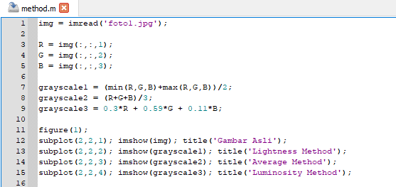

**Nama : Meyda Wikaromah**

**Nim : 2110131220015**

**Mata Kuliah : Pemrosesan Citra Digital**

## **Mengubah gambar menjadi Grayscale dengan Lightness Method, Average Method, dan Luminosity Method.**

Citra RGB merupakan citra yang tersusun oleh tiga kanal warna yaitu kanal merah, kanal hijau, dan kanal biru. Pada citra RGB 24-bit, masing-masing kanal warna memiliki nilai intensitas piksel dengan kedalaman bit sebesar 8-bit yang artinya memiliki variasi warna sebanyak 2^8 = 256 derajat warna (0-255). Setiap piksel pada citra RGB memiliki nilai intensitas yang merupakan kombinasi dari nilai R, G, dan B. Variasi warna pada setiap piksel pada citra RGB adalah sebanyak 256 x 256 x 256 = 16.777.216.

Citra grayscale merupakan citra yang hanya memiliki satu kanal warna. Pada citra grayscale 8-bit, setiap piksel memiliki nilai intensitas warna yang memiliki variasi sebanyak 2^8 = 256 derajat warna (0-255). Nilai intensitas pada citra ini merupakan representasi dari derajat keabuan dimana nilai 0 menyatakan warna hitam sempurna dan nilai 255 menyatakan warna putih sempurna. Nilai intensitas antara 0-255 merupakan warna abu-abu. 

Grayscale adalah teknik yang digunakan untuk mengubah citra berwarna (RGB) menjadi bentuk grayscale atau tingkat keabuan (dari hitam ke putih). Dengan pengubahan ini matriks penyusun citra yang sebelumnya
3 matriks akan berubah menjadi 1 matriks saja. 

Untuk mengubah citra RGB menjadi citra grayscale terdapat tiga method yang dapat digunakan yaitu Lightness Method, Average Method, dan Luminosity Method.

Berikut contoh penerapan ketiga method tersebut.

    

    

## **Ulasan tentang Halftoning, Patterning, dan Dithering**

**a. Halftoning**

Digital halftoning adalah suatu proses untuk mengkonversi citra yang kontinu ke dalam suatu array
berupa titik-titik. Jika dilihat oleh sistem visual manusia, pola tersebut akan  menciptakan suatu ilusi sehingga citra tersebut tampak bukan seperti citra hitam putih, namun seperti citra abu-abu yang kontinu. 

Metode yang paling sederhana untuk mengkonversi citra abu-abu menjadi citra biner adalah dengan menggunakan teknik ambang batas(thresholding), yaitu dengan dua tingkat (satu bit) kuantisasi. Misalkan f(i,j) adalah sebuah citra abu-abu dan b(i,j) adalah citra yang dihasilkan dari metode ambang batas yang sederhana.

Halftoning bertujuan untuk memberikan kesan warna citra biner tampak seperti citra abu-abu meskipun hanya menggunakan piksel warna hitam dan putih saja. Meskipun teknik ambang batas(thresholding) yang sederhana ini dapat mengkonversi citra abu-abu menjadi citra biner, namun kualitas citra yang dihasilkan masih kurang baik. 

**b. Patterning**

Patterning adalah teknik sederhana memberi warna pada objek gambar dengan pola-pola tertentu. Patterning mengubah ukuran sesuai dengan pola.

**c. Dithering**

Dithering merupakan suatu teknik dalam komputer grafik untuk menciptakan kedalaman warna pada gambar dari sekumpulan warna yang ada. Dengan cara ini, warna yang tidak tersedia dari color palette akan diciptakan dengan difusi beberapa pixel dari color palette yang ada. Mata manusia mengenali difusi ini sebagai pencampuran warna. Dithering mirip dengan halftoning yang digunakan dalam printing. 

Cara kerja dithering adalah dengan mengurangi kedalaman warna dari sebuah gambar, memberikan efek yang cukup signifikan terhadap gambar tersebut. Dithering memvariasi jarak pada titik, mengubah gambar menjadi dua warna, dan tidak mengubah ukuran tetapi detailnya.

Dithering adalah pilihan dalam efek gradasi untuk menciptakan ilusi warna ketiga dengan mencampurkan foreground dan background. Misalnya, foreground hitam dan background putih, saat membuat efek gradasi dengan dithering akan tercipta warna ketiga yaitu abu-abu di antara kedua warna.

