**Nama : Meyda Wikaromah**

**Nim : 2110131220015**

**Mata Kuliah : Pemrosesan Citra Digital**

## **Mengubah gambar menjadi Grayscale dengan Lightness Method, Average Method, dan Luminosity Method.**

Citra RGB merupakan citra yang tersusun oleh tiga kanal warna yaitu kanal merah, kanal hijau, dan kanal biru. Pada citra RGB 24-bit, masing-masing kanal warna memiliki nilai intensitas piksel dengan kedalaman bit sebesar 8-bit yang artinya memiliki variasi warna sebanyak 2^8 = 256 derajat warna (0-255). Setiap piksel pada citra RGB memiliki nilai intensitas yang merupakan kombinasi dari nilai R, G, dan B. Variasi warna pada setiap piksel pada citra RGB adalah sebanyak 256 x 256 x 256 = 16.777.216.

Citra grayscale merupakan citra yang hanya memiliki satu kanal warna. Pada citra grayscale 8-bit, setiap piksel memiliki nilai intensitas warna yang memiliki variasi sebanyak 2^8 = 256 derajat warna (0-255). Nilai intensitas pada citra ini merupakan representasi dari derajat keabuan dimana nilai 0 menyatakan warna hitam sempurna dan nilai 255 menyatakan warna putih sempurna. Nilai intensitas antara 0-255 merupakan warna abu-abu. 

Grayscale adalah teknik yang digunakan untuk mengubah citra berwarna (RGB) menjadi bentuk grayscale atau tingkat keabuan (dari hitam ke putih). Dengan pengubahan ini matriks penyusun citra yang sebelumnya
3 matriks akan berubah menjadi 1 matriks saja. 

Untuk mengubah citra RGB menjadi citra grayscale terdapat tiga method yang dapat digunakan yaitu Lightness Method, Average Method, dan Luminosity Method.

Berikut contoh penerapan ketiga method tersebut.

    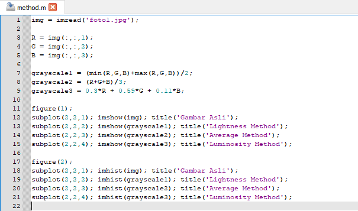

- grayscale1 = (min(R,G,B)+max(R,G,B))/2; adalah rumus yang digunakan untuk mengubah citra RGB menjadi grayscale menggunakan Lightness Method.

- grayscale2 = (R+G+B)/3; adalah rumus yang digunakan untuk mengubah citra RGB menjadi grayscale menggunakan Average Method.

- grayscale3 = 0.3*R + 0.59*G + 0.11*B; adalah rumus yang digunakan untuk mengubah citra RGB menjadi grayscale menggunakan Luminosity Method.

Hasil :

    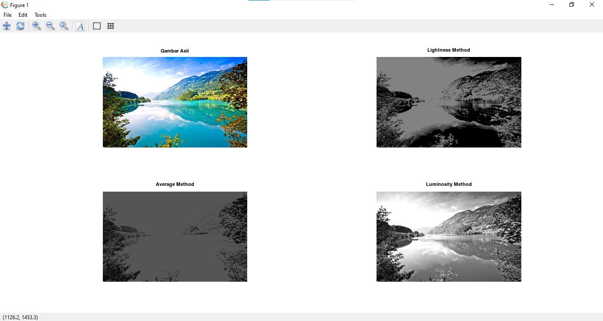

    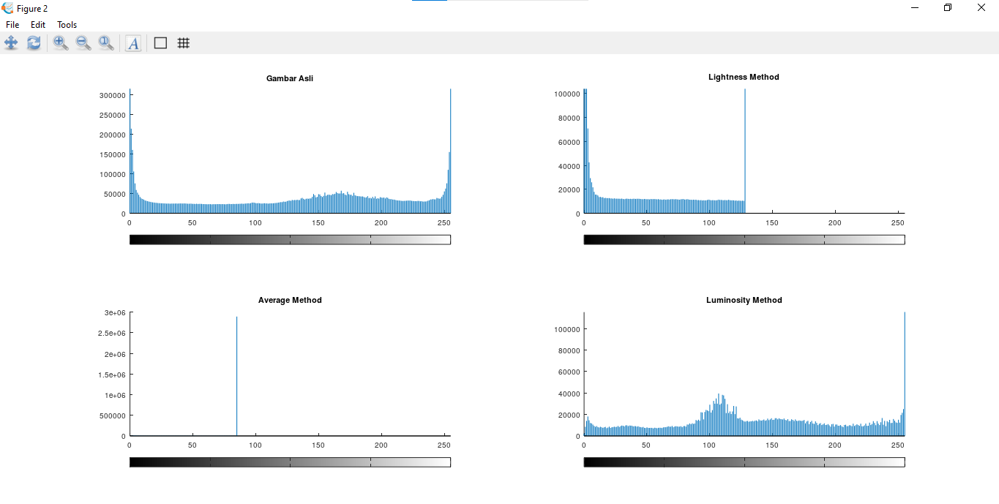

## **Halftoning, Patterning, dan Dithering**

**a. Halftoning**

Digital halftoning adalah suatu proses untuk mengkonversi citra yang kontinu ke dalam suatu array
berupa titik-titik. Jika dilihat oleh sistem visual manusia, pola tersebut akan  menciptakan suatu ilusi sehingga citra tersebut tampak bukan seperti citra hitam putih, namun seperti citra abu-abu yang kontinu. 

Metode yang paling sederhana untuk mengkonversi citra abu-abu menjadi citra biner adalah dengan menggunakan teknik ambang batas(thresholding), yaitu dengan dua tingkat (satu bit) kuantisasi. Misalkan f(i,j) adalah sebuah citra abu-abu dan b(i,j) adalah citra yang dihasilkan dari metode ambang batas yang sederhana.

Halftoning bertujuan untuk memberikan kesan warna citra biner tampak seperti citra abu-abu meskipun hanya menggunakan piksel warna hitam dan putih saja. Meskipun teknik ambang batas(thresholding) yang sederhana ini dapat mengkonversi citra abu-abu menjadi citra biner, namun kualitas citra yang dihasilkan masih kurang baik. 

Halftoning atau halftoning analog adalah proses yang mensimulasikan nuansa abu-abu dengan memvariasikan ukuran titik-titik hitam kecil yang diatur dalam pola yang teratur. Teknik ini digunakan dalam printer, serta industri penerbitan. Jika Anda memeriksa sebuah foto di koran, Anda akan melihat bahwa gambar itu terdiri dari titik-titik hitam meskipun tampaknya terdiri dari abu-abu. Hal ini dimungkinkan karena integrasi spasial yang dilakukan oleh mata kita. Mata kita memadukan detail halus dan merekam intensitas keseluruhan. Halftoning digital mirip dengan halftoning di mana gambar didekomposisi menjadi kotak sel halftone. Elemen (atau titik yang digunakan halftoning dalam mensimulasikan nuansa abu-abu) dari sebuah gambar disimulasikan dengan mengisi sel halftone yang sesuai. Semakin banyak jumlah titik hitam dalam sel halftone, semakin gelap sel tersebut. Misalnya, pada Gambar 4, sebuah titik kecil yang terletak di tengah disimulasikan dalam halftoning digital dengan mengisi sel halftone tengah; demikian juga, titik ukuran sedang yang terletak di sudut kiri atas disimulasikan dengan mengisi empat sel di sudut kiri atas. Titik besar yang menutupi sebagian besar area pada gambar ketiga disimulasikan dengan mengisi semua sel halftone.

    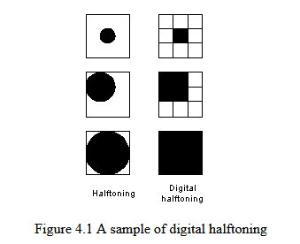

Tiga metode umum untuk menghasilkan gambar halftoning digital adalah:

1. Patterning
2. Dithering
3. Error Difusion

**b. Patterning**

Patterning merupakan teknik sederhana memberi warna pada objek gambar dengan pola-pola tertentu. Patterning mengubah ukuran sesuai dengan pola. Patterning mewarnai dengan mengisi bidang kosong dengan pola yang di gambar secara berulang.

Patterning adalah yang paling sederhana dari tiga teknik untuk menghasilkan gambar halftoning digital. Ini menghasilkan gambar yang memiliki resolusi spasial lebih tinggi daripada gambar sumber. Jumlah sel halftone citra keluaran sama dengan jumlah piksel citra sumber. Namun, setiap sel halftone dibagi lagi menjadi kotak 4x4. Setiap nilai piksel input diwakili oleh jumlah kotak terisi yang berbeda dalam sel halftone. Karena kisi 4x4 hanya dapat mewakili 17 tingkat intensitas yang berbeda, gambar sumber harus dikuantisasi. Gambar 4.2 menunjukkan matriks pola rekursif Rylander, yang akan digunakan dalam daftar 4.1, dan contoh operasi pola.

    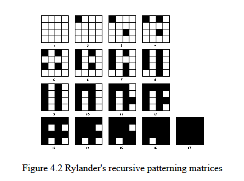

    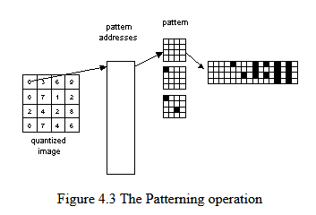

Pattern menghasilkan gambar halftoning digital dari gambar input menggunakan teknik pola. Pola program membaca gambar input, mengkuantisasi nilai piksel, dan memetakan setiap piksel ke pola yang sesuai. Gambar yang dihasilkan 16 kali lebih besar dari aslinya. Gambar yang dihasilkan ditulis ke file output sebagai file TIFF. Sebuah kata peringatan: "patterning" membutuhkan banyak perhitungan, gambar berukuran kurang dari 100x100 direkomendasikan.

Contoh ini menghasilkan gambar halftoning digital dari painter menggunakan teknik patterning (Gambar 4.4).

    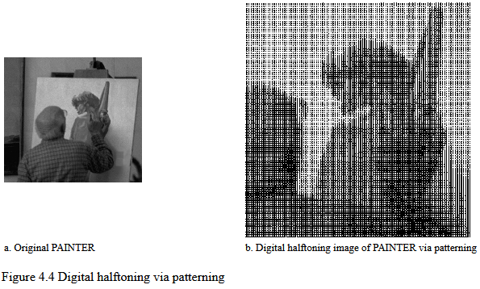

**c. Dithering**

Dithering merupakan suatu teknik dalam komputer grafik untuk menciptakan kedalaman warna pada gambar dari sekumpulan warna yang ada. Dengan cara ini, warna yang tidak tersedia dari color palette akan diciptakan dengan difusi beberapa pixel dari color palette yang ada. Mata manusia mengenali difusi ini sebagai pencampuran warna. Dithering mirip dengan halftoning yang digunakan dalam printing. 

Cara kerja dithering adalah dengan mengurangi kedalaman warna dari sebuah gambar, memberikan efek yang cukup signifikan terhadap gambar tersebut. Dithering memvariasi jarak pada titik, mengubah gambar menjadi dua warna, dan tidak mengubah ukuran tetapi detailnya.

Dithering adalah pilihan dalam efek gradasi untuk menciptakan ilusi warna ketiga dengan mencampurkan foreground dan background. Misalnya, foreground hitam dan background putih, saat membuat efek gradasi dengan dithering akan tercipta warna ketiga yaitu abu-abu di antara kedua warna.

Tidak seperti patterning, dithering membuat gambar keluaran dengan jumlah titik yang sama dengan jumlah piksel pada gambar sumber. Dithering dapat dianggap sebagai thresholding gambar sumber dengan matriks gentar. Matriks diletakkan berulang kali di atas gambar sumber. Dimanapun nilai piksel gambar lebih besar dari nilai dalam matriks, titik pada gambar output diisi. Masalah dithering yang terkenal adalah menghasilkan artefak pola yang diperkenalkan oleh matriks ambang batas tetap. Gambar 4.5 menunjukkan contoh operasi dithering.

    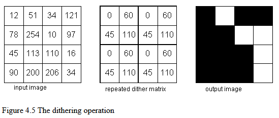

Sinopsis pertama menggunakan matriks gentar default untuk ambang batas gambar input. Dither default adalah

    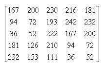

Matriks ini adalah matriks dither persegi panjang yang diekstraksi dari matriks dither 450. 450 matriks dither dapat membuat artefak kurang jelas. Sinopsis kedua, di sisi lain, menggunakan matriks dither yang ditentukan oleh pengguna. dither membaca dalam gambar input, membandingkan setiap piksel dengan elemen yang sesuai dalam matriks dither, menghasilkan gambar output, dan menulisnya ke file output, yang dalam format TIFF. Sebuah kata peringatan: karena "dither" membutuhkan banyak perhitungan, gambar berukuran kurang dari 100x100 direkomendasikan.

Contoh ini menghasilkan gambar halftone digital dari LENA menggunakan matriks dither default (Gambar 4.5a.) dan gambar halftone digital dari PAINTER menggunakan matriks dither yang ditentukan oleh pengguna (Gambar 4.5b.)

    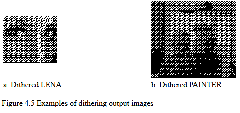

## **Cara menentukan pola pada patterning dan dithering**

**Patterning**

Patterning menghasilkan gambar yang memiliki resolusi spasial lebih tinggi daripada gambar sumber. Jumlah sel halftone citra keluaran sama dengan jumlah piksel citra sumberJumlah sel halftone citra keluaran sama dengan jumlah piksel citra sumber. Namun, setiap sel halftone dibagi lagi menjadi kotak 2x2, 3x3, 4x4 atau lainnya. Setiap nilai piksel input diwakili oleh jumlah kotak terisi yang berbeda dalam sel halftone.  Misal kisi 4x4, karena kisi 4x4 hanya dapat mewakili 17 tingkat intensitas yang berbeda, gambar sumber harus dikuantisasi. 17 tingkat intensitas di dapat dari hasil kali 4x4+1. 

    

Pattern menghasilkan gambar halftoning digital dari gambar input menggunakan teknik pola. Pola program membaca gambar input, mengkuantisasi nilai piksel, dan memetakan setiap piksel ke pola yang sesuai. Pola yang dibuat berbeda-beda, pola yang sama tidak dimasukkan (pola titiknya sama jika diputar). Rumus mencari rentang pada pola yaitu dengan membagi level gambar dengan banyaknya pola.

**Dithering**

Metode dithering dengan kurva pengisian ruang terdiri dari empat langkah: membagi domain gambar ke dalam sel, menghitung intensitas gambar rata-rata di dalam setiap sel, menghasilkan pola titik hitam dan putih dengan intensitas rata-rata sel, memposisikan pola titik di dalam sel untuk menghasilkan cluster. Pembagian domain citra ke dalam sel dilakukan dengan mengikuti jalur kurva pengisian ruang hingga jumlah elemen yang dikunjungi sama dengan ukuran sel. 

membuat pola pada dithering :

    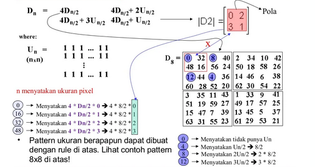

## **Menentukan matriks threshold pada dithering dan mengapa luas (ukuran gambar) mempengaruhi dithering.**

Thresholding memainkan peranan penting dalam proses segmentasi citra dokumen. Tujuan 
thresholding ini adalah menemukan nilai threshold yang tepat untuk memisahkan objek dari 
background. Metode ini digunakan untuk menganalisis gambar skala abu-abu menjadi citra biner dan 
metode ini mengasumsikan bahwa objek yang berbeda dalam sebuah gambar dapat dibedakan 
dengan nilai abu-abu dan kunci untuk metode ini adalah bagaimana menentukan ambang batas. 
Metode ini juga digunakan untuk mengonversi data image menjadi data biner dengan tujuan agar 
proses selanjutnya menjadi mudah. Masukan dari proses ini dapat berupa citra grayscale atau citra 
RGB dimana implementasi yang paling sederhana akan menghasilkan citra biner atau binary image. 
Binary gambar yang dihasilkan dari proses thresholding ini dapat diatur sehingga citra ini hanya 
memiliki dua macam warna saja yaitu warna hitam yang merepresentasikan background dan diwakili 
oleh level 0 serta warna putih yang merepresentasikan foreground dan diwakili oleh level 1. Penentuan threshold dapat menggunakan metode Normal Probability Density Function (NPDF).

Normal Probability Density Function (NPDF) atau kepadatan dari suatu variabel acak kontinu adalah 
fungsi yang menggambarkan kemungkinan relatif untuk variabel acak ini untuk mengambil nilai yang diberikan. Probabilitas variabel acak jatuh dalam kisaran nilai tertentu yang diberikan oleh integral dari 
kepadatan variabel ini atas rentang. yaitu, daerah di bawah fungsi kepadatan tetapi di atas sumbu 
horisontal dan antara nilai terendah dan terbesar jangkauan. Sekumpulan fungsi ini sering digunakan 
dalam teori statistika untuk menjelaskan perilaku suatu distribusi probabilitas teoretis. Statistika adalah 
bagian dari matematika yang secara khusus membicarakan cara cara pengumpulan, analisis dan 
penafsiran data. Distribusi probabilitas yang terpenting dalam statistik adalah distribusi normal atau disebut juga 
distribusi gaussian. Fungsi probability density function pada setiap pixelx dengan mean u 
variance yang memiliki distribusi normal adalah :

    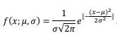

    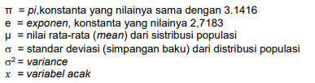

