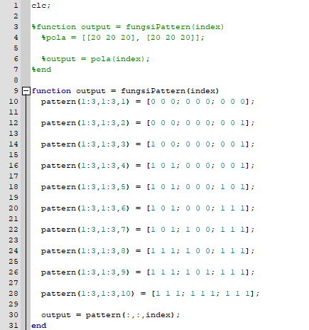
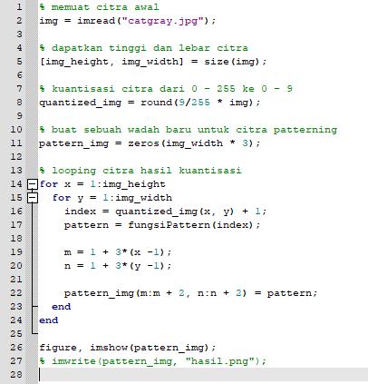
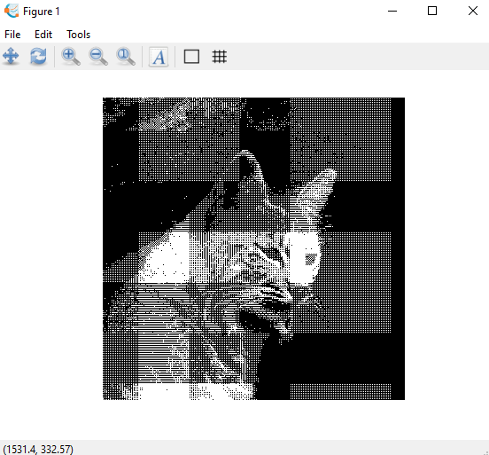
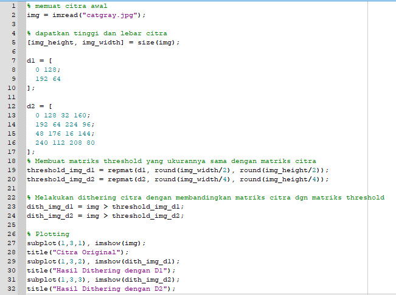
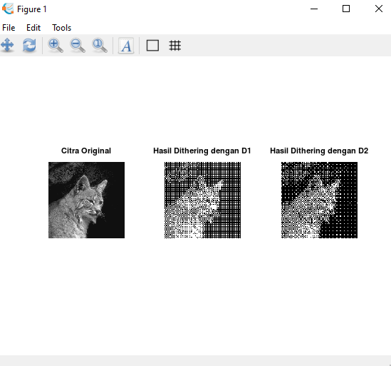
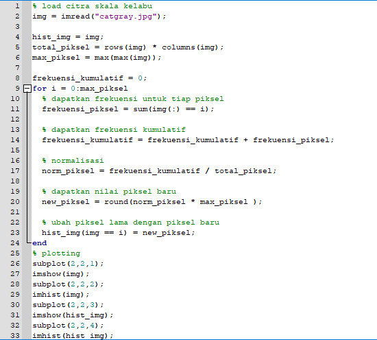
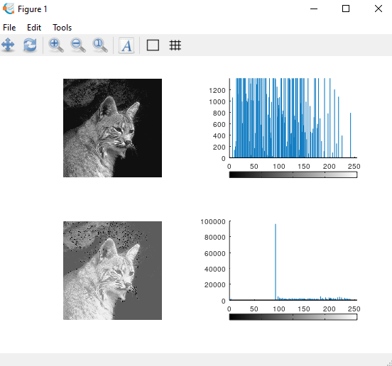

**Nama : Meyda Wikaromah**

**Nim : 2110131220015**

**Mata Kuliah : Pemrosesan Citra Digital**

## **Membuat Algoritma Deskripsi dan Contoh Penerapannya pada Octave**

**1. Patterning**

Algoritma :

1). Menyedikan citra matriks.

2). Menentukan jumlah level dari citra.

3). Menentukan banyak pola, misal pada citra 3x3 maka banyak pola adalah 3x3+1 = 10 pola.

4). Menentukan rentang pola dengan membagi level dengan banyak pola.

5). Membuat pola-pola. Setiap pola berbeda, pola yang memiliki titik yang sama ketika diputar tidak dimasukan.

6). Menerapkan pola sesuai dengan nilai-nilai pada citra matriks sehingga menghasilkan pola yang baru.

Contoh penerapannya pada Octave :

function Pattern yang menyimpan pola-pola :

    

    

Hasil :

    

**2. Dithering**

Algoritma :

1). Menyediakan citra matriks.

2). Menentukan matriks threshold.

3). Membandingkan nilai matriks pada citra dengan nilai matriks threshold. Jika nilainya lebih besar maka warna yang terbentuk adalah putih, jika nilainya lebih kecil maka warna yang terbentuk adalah hitam.

4). Dari hasil perbandingan nilai maka akan terbentuk sebuah pola.

Contoh penerapannya pada Octave :

    

Hasil :

    

**3. Histogram Equalization**

Algoritma :

1). Menentukan Gray Level dan No of Pixel.

2). Run Sum (menghitung setiap No of Pixel secara berurutan).

3). Normalized (membagi setiap nilai yang telah di run sum dengan nilai run sum terakhir atau jumlah nilai dari No of Pixel).

4). Multiply 7 (mengalikan setiap nilai yang telah di normalized dengan 7)

5). Hasil dari multiply 7 menentukan perubahan dari tiap-tiap nilai pada No of Pixel.

Contoh penerapannya pada Octave :

    

    

**4. Bit-plane Slicing**

Algoritma :

1). Menyediakan citra.

2). Mengubah setiap nilai matriks yang ada pada citra dari desimal ke biner.

3). Mengambil tiap-tiap bit untuk menghasilkan matriks yang baru.

4). Dari pengambilan tiap-tiap bit dapat ditentukan LSB (Last Significan Bit) dan MSB (Most Significan Bit).

Contoh penerapannya pada Octave :

    

Hasil :

    

