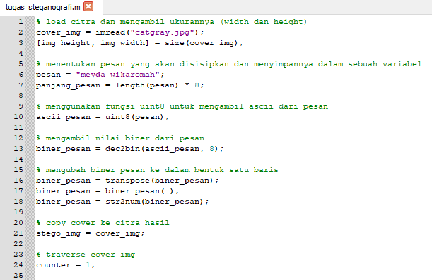
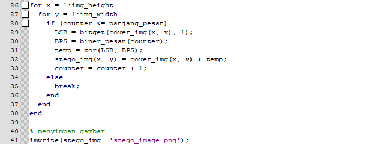

**Nama : Meyda Wikaromah**

**Nim : 2110131220015**

**Mata Kuliah : Pemrosesan Citra Digital**

## **Simple Steganografi**

**1. Pengertian Steganografi**

Steganografi atau Steganography adalah sebuah ilmu, teknik atau seni menyembunyikan sebuah pesan rahasia dengan suatu cara sehingga pesan tersebut hanya akan diketahui oleh si pengirim dan si penerima pesan.

Steganografi berasal dari Bahasa Yunani yaitu Stegano yang berarti “tersembunyi atau menyembunyikan” dan graphy yang berarti “tulisan".  Jadi Steganografi adalah tulisan atau pesan yang disembunyikan. Steganografi merupakan kebalikan dari Kriptografi yang menyamarkan arti dari sebuah pesan rahasia saja, tetapi tidak menyembunyikan bahwa ada sebuah pesan. Kelebihan Steganografi dibandingkan dengan Kriptografi adalah pesan-pesannya akan dibuat tidak menarik perhatian dan tidak menimbulkan kecurigaan, berbeda dengan Kriptografi yang pesannya tidak disembunyikan, walaupun pesannya sulit untuk di pecahkan akan tetapi itu akan menimbulkan kecurigaan terhadap pesan tersebut.

**2. Prinsip Kerja Steganografi**

Pesan rahasia yang akan disembunyikan disisipkan pada suatu media penampung seperti citra, suara, video dan sebagainya yang terlihat tidak mencurigakan untuk menyimpan pesan rahasia. Pesan rahasia akan memerlukan sebuah kunci rahasia yang dinamakan stego-key agar hanya pihak yang berhak saja yang dapat membuka pesan tersebut.

Contoh Penerapan Steganografi :

    
    

ini adalah citra asli sebelum disisipkan sebuah pesan :

    

    (Gambar 1)

ini adalah citra baru setelah disisipkan sebuah pesan :

    

    (Gambar 2)

Dari dua gambar diatas terlihat seperti tidak ada perbedaan dari gambar tersebut. Padahal gambar 2 memiliki sebuah pesan rahasia didalamnya.

    

    (Gambar 2.1)

Jika gambar 2 kita buat seperti tampilan di atas maka terlihat bagian garis putih adalah letak pesan rahasia yang kita sisipkan.

