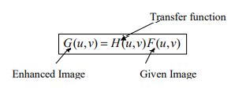

**Nama : Meyda Wikaromah**

**Nim : 2110131220015**

**Mata Kuliah : Pemrosesan Citra Digital**

## **IMAGE ENHANCEMENT**

Image Enhancement (peningkatan kualitas citra) merupakan satu proses awal dalam pengolahan citra (preprocessing). Image Enhancement mengacu pada proses menyoroti informasi tertentu dari suatu citra, serta melemahkan atau menghapus informasi yang tidak perlu sesuai dengan kebutuhan tertentu. Misalnya, menghilangkan noise, mengungkapkan detail buram, dan menyesuaikan level untuk menyorot fitur gambar. Tujuan dari dilakukannya peningkatan kualitas citra adalah untuk memperoleh citra yang lebih sesuai digunakan untuk aplikasi lebih lanjut.

Proses-proses yang termasuk ke dalam perbaikan kualitas citra:

- Pengubahan kecerahan gambar (image brightening)

- Citra negatif (image negatives)

- Peregangan kontras (contrast stretching)

- Pengubahan histogram citra

- Pelembutan citra (image smoothing)

- Penajaman (sharpening) tepi (edge)

- Pewarnaan semu (pseudocolouring)

- Pengubahan geometrik

- dan lainnya.

Teknik peningkatan kualitas citra dapat dibagi menjadi dua kategori yaitu:

1. Domain Spasial : Peningkatan ruang gambar yang membagi gambar menjadi piksel yang seragam sesuai dengan koordinat spasial dengan resolusi tertentu. Metode domain spasial melakukan operasi pada piksel secara langsung.

2. Domain Frekuensi : Peningkatan yang diperoleh dengan menerapkan transformasi Fourier ke domain spasial. Dalam domain frekuensi, piksel dioperasikan dalam kelompok dan juga secara tidak langsung.

**1. Domain Spasial**

Istilah domain spasial mengacu pada bidang gambar itu sendiri dan metode dalam kategori ini didasarkan pada direct manipulasi pixel dalam sebuah citra atau memanipulasi secara langsung pixel-pixel di dalam citra.

Metode pemrosesan citra dalam domain spasial dinyatakan sebagai:

    g(x,y) = T [ f(x,y) ]

Dimana :

- f(x,y) : citra input

- g(x,y) : citra output

- T adalah operator terhadap f. 

T bisa beroperasi pada satu pixel, sekelompok pixel bertetangga, atau keseluruhan pixel di dalam citra.

    

    (T beroperasi pada satu pixel)

    

    (T beroperasi pada sekelompok pixel bertetangga)

    

    (T beroperasi pada keseluruhan pixel di dalam citra)

Metode dalam domain spasial dapat dilakukan pada aras titik (pixel), aras lokal, dan aras global. 

**Pemrosesan dalam aras titik**

- g(x,y) = T [ f(x,y) ]

- T hanya beroperasi pada satu pixel

- T adalah fungsi transformasi nilai grayscale, sehingga ditulis:

s = T(r)

dimana :

r : variabel yang menyatakan nilai grayscale f(x,y) 

s : variabel yang menyatakan nilai grayscale g(x,y) 

Contoh-contoh image enhancement dalam aras titik:

**1. Mencerahkan citra (image brightening)**

Kecerahan citra dapat diperbaiki dengan menambahkan/mengurangkan sebuah konstanta kepada (atau dari) setiap pixel, atau mengalikan sebuah konstansta ke setiap pixel.

r = s + b

- Jika b positif, kecerahan citra bertambah, jika b negatif kecerahan citra berkurang

- Perlu operasi clipping jika nilai r + b berada di bawah nilai intensitas
minimum atau di atas nilai intensitas maksimum:

- jika r + b > 255, maka s = 255

- jika r + b < 0, maka s = 0

    

Operasi pencerahan yang lain adalah menggunakan rumus:

r = as + b

a dan b adalah konstanta

**2. Menegatifkan citra (image negatives)**

- Seperti film negatif pada fotografi.

- Misalkan citra memiliki L derajat keabuan

- Caranya: kurangi nilai intensitas pixel dari nilai keabuan maksimum (L – 1)

s = (L – 1) – r 

Contoh pada citra grayscale 8-bit:

s = 255 – r

    

**3. Perbaikan kontras (contrast enhancement)**

    

- r = graylevel citra masukan
- s = graylevel citra luaran
- T = fungsi perbaikan kontras
- m = nilai ambang

Pada (a) Nilai-nilai pixel < m dibuah lebih gelap, nilai-nilai pixel >= m dibuat lebih terang. Operasi peregangan kontras (contrast stretching).

Pada (b) Nilai-nilai pixel < m dibuah menjadi hitam, nilai-nilai pixel >= m dibuah menjadi putih. Operasi pengambangan (thresholding).

**4. Gamma correction**

**2. Domain Frekuensi**

- Konsep penyaringan lebih mudah divisualisasikan dalam frekuensi
domain. Oleh karena itu, peningkatan citra f (m,n) dapat dilakukan
dalam domain frekuensi, berdasarkan DFT F(u, v).

- Ini sangat berguna, jika perluasan spasial dari urutan penyebaran titik h(m, n) besar. Dalam hal ini, konvolusi mungkin secara komputasi tidak menarik.

    

- Oleh karena itu, kita dapat secara langsung merancang fungsi transfer H (u, v) dan
mengimplementasikan peningkatan dalam domain frekuensi sebagai
berikut:

    

**Lowpass filtering**

- Tepi dan transisi tajam dalam nilai abu-abu dalam gambar berkontribusi
signifikan terhadap konten frekuensi tinggi dari transformasi Fourier-nya.

- Wilayah dengan nilai abu-abu yang relatif seragam dalam sebuah gambar berkontribusi
ke konten frekuensi rendah dari transformasi Fourier-nya.

- Oleh karena itu, sebuah gambar dapat dihaluskan dalam domain Frekuensi dengan
melemahkan konten frekuensi tinggi dari transformasi Fourier-nya.
Ini akan menjadi filter lowpass.

- Untuk kesederhanaan, kami hanya akan mempertimbangkan filter yang nyata
dan simetri radial.

- Filter lowpass yang ideal dengan frekuensi cutoff r0 :

    

    

- Perhatikan bahwa titik asal (0, 0) berada di tengah dan bukan di sudut
gambar (ingat operasi "fftshift").

- Transisi mendadak dari 1 ke 0 dari fungsi transfer
H (u,v) tidak dapat diwujudkan dalam praktik, menggunakan elektronik
komponen. Namun, itu dapat disimulasikan di komputer.

    

- Perhatikan efek dering yang parah pada gambar buram, yang
merupakan karakteristik filter ideal. Hal ini karena diskontinuitas
dalam fungsi transfer filter.

**Butterworth lowpass filter**

Filter lowpass Butterworth dua dimensi memiliki transfer
fungsi:

    

    

- Respons frekuensi tidak memiliki transisi yang tajam seperti pada
LP yang ideal.

- Ini lebih sesuai untuk penghalusan gambar daripada yang ideal
LPF, karena ini tidak memperkenalkan dering.

    

    

    

