**Nama : Meyda Wikaromah**

**Nim : 2110131220015**

**Mata Kuliah : Pemrosesan Citra Digital**

## **IMPLEMENTASI LOW PASS FILTERING, HIGH PASS FILTERING,  HIGH BOOST FILTERING, MEDIAN FILTER, DAN EDGE DETECTION PADA OCTAVE**

### **LOW PASS FILTERING**

#### 1. Manual

Kode program :

    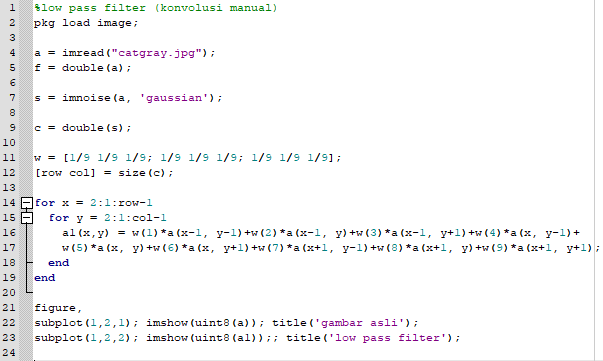

Hasil :

    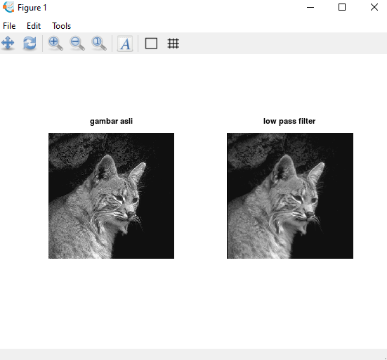

#### 2. Menggunakan fungsi pada octave

Kode program :

    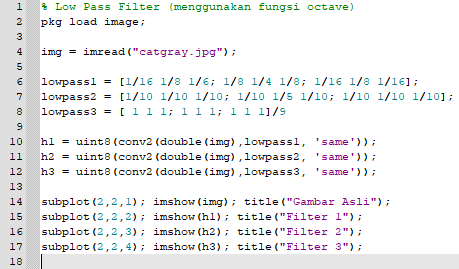

Hasil :

    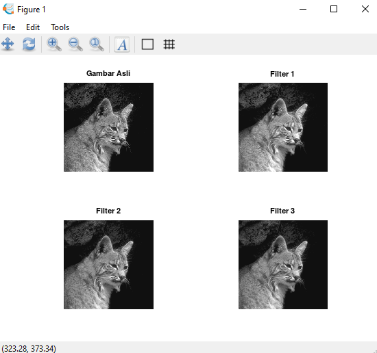

### **HIGH PASS FILTERING**

#### 1. Manual

Kode program :

    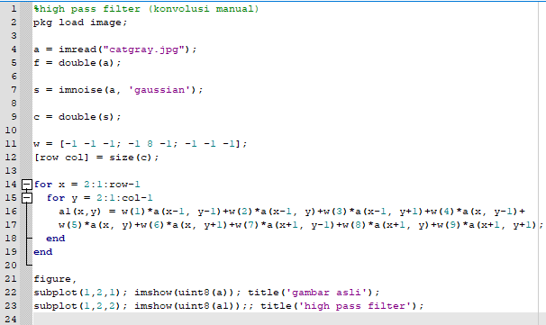

Hasil :

    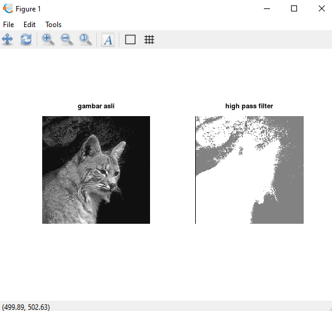

#### 2. Menggunakan fungsi pada octave

Kode program :

    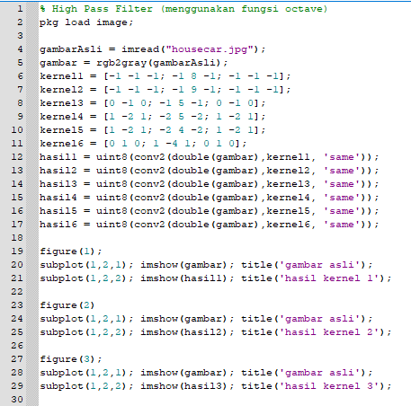

    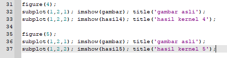

Hasil :

    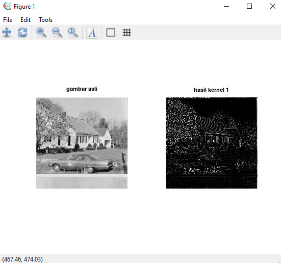

    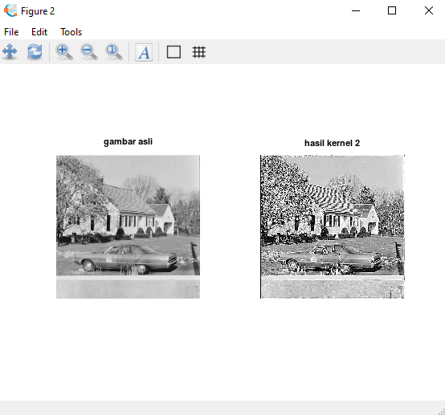

    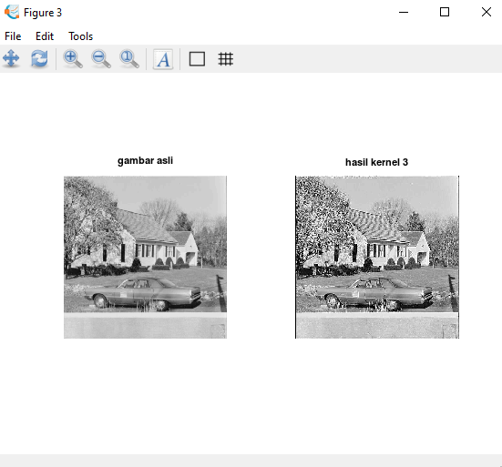

    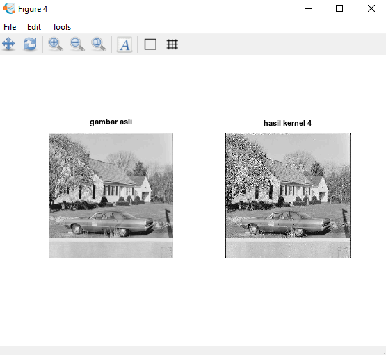

    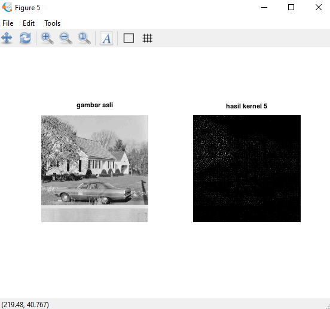

### **HIGH BOOST FILTERING**

#### 1. Manual

#### 2. Menggunakan fungsi pada octave

Kode program :

    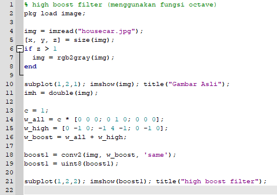

Hasil :

    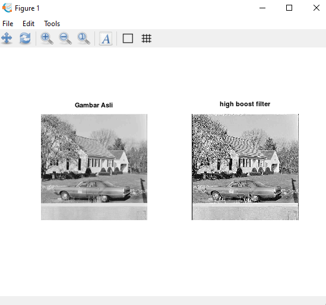

### **MEDIAN FILTER**

#### 1. Manual

Kode program :

    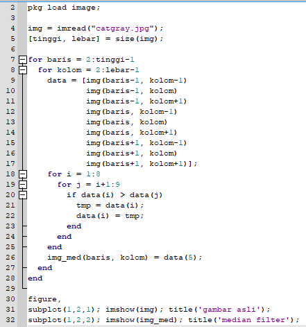

Hasil :

    

#### 2. Menggunakan fungsi pada octave

Kode program :

    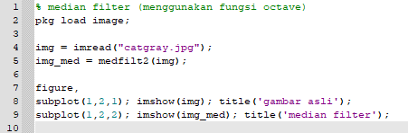

Hasil :

    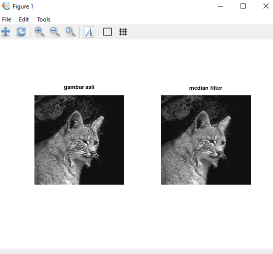

### **EDGE DETECTION**

#### 1. Manual

#### 2. Menggunakan fungsi pada octave

Kode program :

    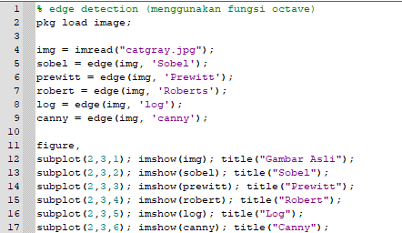

Hasil :

    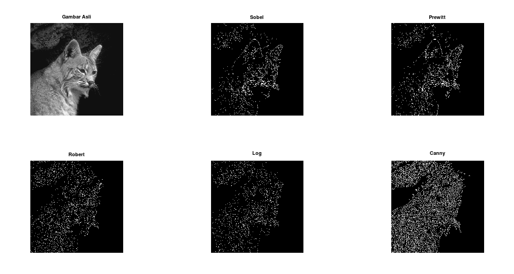

